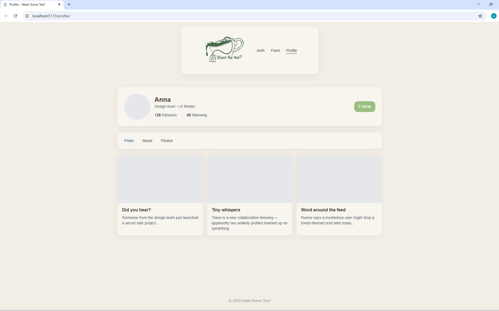

 # Want Some Tea?

A calm, tea-inspired social media prototype built with **Tailwind CSS** for the CSS Frameworks course assignment.



---

## About the project
This project was created for the **CSS Frameworks** course assignment (Option 2).  
The goal was to design a **responsive front end** for a social media app using **Tailwind CSS**, with consistent theming and accessible layout across all screen sizes.

I wanted to explore a friendly, cozy atmosphere, a mix of tea culture and gentle gossip (“spilling the tea”).  
The soft colors, rounded cards and subtle hover effects reflect that relaxed theme.

---

##  Pages
### 1️⃣ Authentication (`/index.html`)
- Log in / Register form  
- HTML form validation  
- Redirects to `/profile` on submit  

### 2️⃣ Feed (`/feed/index.html`)
- Search and sort layout  
- Form to create a new post  
- Example posts with “tea-style” gossip  
- Fully responsive grid  

### 3️⃣ Profile (`/profile/index.html`)
- Profile info card (avatar, username, followers/following)  
- Post grid  
- Follow button with tea-themed color  

---
## Design theme

- **Font:** [Montserrat](https://fonts.google.com/specimen/Montserrat)  
- **Main color:** `#9baf80` (mild green)  
- **Background:** `#f3eee5` (soft cream)  
- **Accent:** warm tea brown & muted greens  
- **Custom favicon and logo drawn by me**

## Tech stack
- **Tailwind CSS v4** (installed via npm)  
- **PostCSS** & **Autoprefixer**  
- **Custom CSS variables** for theme palette  
- Responsive grid & flex layouts  
- No JavaScript functionality required  

---

### Setup
Clone the repo and install dependencies:
```bash
npm install 
```

Run Tailwind in development mode:
```bash
npm run dev
```

Build for production:
```bash
npm run build
```

Preview the site:
```bash
npm run preview
```

